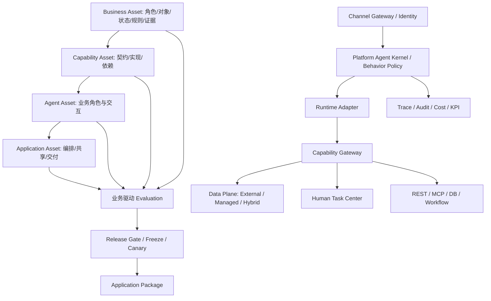

# Forma · Business-to-Agent Platform 总体产品设计

版本：1.0 · 全新设计基线 · 2026-08-31

本方案以本轮明确的 16 项需求为唯一功能基线，从零重构资产模型、信息架构和用户流程。沿用业务讨论中的概念，不沿用旧原型代码、导航或页面结构。“Forma”为本轮原型工作名称，不代表已完成商标或品牌核验。

## 1. 产品定位与边界

**将企业业务知识，工程化为可验证、可治理、可交付的 Agent 应用。**

平台服务企业业务负责人、业务分析师、集成工程师、Agent 构建者、质量负责人、发布管理员和客户交付团队。它连接业务共识与实际运行，产出可版本化资产，而非只生成 Prompt 或聊天界面。

核心价值：客户更换系统时不必重建业务语义；更换 Runtime 时不必重写业务角色；业务变更时能追踪下游影响；交付时能清楚说明包里有什么、测试了什么、谁批准了什么。

产品范围内：业务发现、四层资产管理、数据契约、受控能力执行、多 Agent 应用编排、人工协作、评测发布、渠道适配、治理和商业交付。范围外：替代全部 ERP/CRM/BPM、承诺任意开源框架零成本互换、未经审核自动把访谈结论发布到生产、在前端存储真实 Secret。

成功指标应分层：业务建模到首次可验证应用的周期、已复用能力占比、业务事实确认覆盖率、变更影响追踪覆盖率、交付前回归覆盖率、业务任务成功率、人工接管质量、客户升级成功率。原型里的数值均为演示，不是产品实测。

## 2. 总体架构

控制面管理资产、策略、版本和发布；运行面执行已冻结应用；数据平面维护交易、知识和运行状态的不同生命周期。控制面中的编辑不直接修改运行面。应用运行由稳定的 run_id、tenant_id、actor_id 与 asset_snapshot_id 贯穿。

## 3. 四层核心资产

| 资产 | 负责回答 | 核心内容 | 不能包含 |
|---|---|---|---|
| Business Asset | 企业业务是什么、依据何在 | Role、Object、Process、State、Rule、Evidence、确认与版本 | 直接绑定模型供应商的执行脚本 |
| Capability Asset | 哪个业务动作可安全调用 | 语义 ID、输入输出、权限、副作用、契约、实现绑定、依赖 | 散落在 Prompt 中的隐式接口约定 |
| Agent Asset | 谁在什么业务范围内如何工作 | Role、Context、Capability refs、Rule refs、Permission、Knowledge、Interaction | 重复实现通用会话循环与绕过平台策略 |
| Application Asset | 向客户交付什么完整方案 | 多 Agent 组合、编排、共享资源、渠道、Runtime、策略、依赖锁、评测与包 | 仅用一个“总 Prompt”替代应用配置 |

公共资产头建议包含：tenant_id、asset_id、kind、semantic_version、revision、status、owner、created_by、created_at、updated_at、schema_version、dependency_refs、content_digest、deleted_at。草稿 revision 可以变化；发布版本不可变。所有依赖按明确版本或不可变摘要引用，禁止生产解析 latest。

生命周期：Draft → In Review → Verified → Frozen → Released → Deprecated → Archived。软删除只隐藏可编辑资产，已有发布快照保持可解释和可恢复。被活动草稿引用的 Agent 在原型中禁止删除；生产还必须检查所有应用、环境、定时任务和客户升级包。

## 4. 新信息架构与左侧导航

导航采用“工作空间 / 构建 / 交付 / 运行”四组；四层资产在构建区作为主要工作对象，数据平面显式独立。渠道、Runtime 不再与业务 Agent 混为同一个编辑器。

| 导航 | 路由 | 核心页面体系 |
|---|---|---|
| 总览 | `/` | 资产链路、应用、待办、动态、运行摘要 |
| AI 业务分析师 | `/analyst` | Pattern 选择、访谈、候选事实、来源与澄清 |
| 业务资产 | `/business` | Canvas / Process、证据与确认、版本 Diff、变更影响 |
| 数据平面 | `/data` | 模式、Data Contract、知识、临时数据、隔离与迁移 |
| 能力资产 | `/capabilities` | Registry、Contract、实现、依赖图、OpenAPI Mapping、SDK |
| 业务 Agent | `/agents` | 全部列表、编辑器、版本、测试、导入导出、回收站 |
| 应用构建器 | `/applications` | 组合选择、协作画布、共享资源、降级、Manifest |
| 人工任务 | `/human` | 待处理队列、审批详情、拒绝、恢复、升级 |
| 测试与评测 | `/evaluation` | 生成用例、Mock、Regression、报告 |
| 版本与发布 | `/releases` | 环境晋级、Gate、Freeze、Canary、Rollback |
| 渠道网关 | `/channels` | 9 类入口配置、身份映射、Credential refs |
| 运行时与 Kernel | `/runtime` | Adapter 候选、兼容矩阵、Kernel 分层、Behavior Policy |
| 可观测性 | `/observability` | Runs、Trace、成本、业务 KPI |
| 安全与治理 | `/governance` | 权限、Secret、驻留保留、审计 |
| 商业交付 | `/delivery` | Package、授权、部署、升级 |
| 设计系统 | `/design` | Tokens、组件、状态、Figma / Cursor 交接 |

全局顶部提供工作空间面包屑、环境提示、搜索与待办入口。当前原型只支持一个模拟租户；不能用工作空间按钮暗示真实多租户切换。搜索支持页面名称与英文 route。移动端侧栏收缩为图标并提供可访问名称。

完整产品的列表页应进一步支持保存视图、批量操作、排序、分页、所有者与生命周期筛选；详情页采用 Overview / Definition / Dependencies / Versions / Evaluation / Audit 的共同结构。原型优先实现业务主链，未把所有规模化列表功能伪装为已经完成。

## 5. 核心用户流程

### A. 从业务发现到首次交付

1. 业务分析师选 Pattern，明确角色、对象、状态与异常边界。
2. AI 生成候选事实，每条关联访谈、文档片段、置信度与未确定项。
3. 业务负责人和 IT 负责人分别确认冲突的解决方案。
4. 集成工程师选择 External / Managed / Hybrid，建立 Canonical Schema 和 Mapping。
5. 定义 Capability Contract，选择实现方式，运行契约测试。
6. 构建业务 Agent；配置业务 Role、能力、规则、知识与权限。
7. 选择多个 Agent 构建应用，明确编排与共享范围。
8. 从业务模型生成用例，加入 Mock 与异常回归，Gate 校验当前快照。
9. 冻结版本；Dev → Test → Staging → Prod；灰度观察并具备回滚路径。
10. 导出带依赖、评测与签名的 Application Package，按客户授权交付。

### B. 业务变更

“紧急工单由自动派单取代主管派单”不能直接覆盖旧模型。新建候选规则 → 保存冲突证据 → 双人确认 → 语义 Diff → 沿显式引用计算受影响能力/Agent/应用/测试 → 草稿版本升级 → 重新评测 → 新冻结版本发布。旧生产版本的依赖图保持不变。

### C. 运行时人工接管

Agent 准备执行高风险动作 → Gateway 检查权限与确认条件 → 保存审批请求、输入摘要、资源版本、deadline 与 checkpoint → Human Task 进入队列 → 合资格审批人给出理由 → 比较资源版本与策略 → 恢复执行。超时升级；拒绝终止；重复确认不得重复写入。

### D. 客户更换业务系统

保持 Canonical Contract → 创建新 Adapter 与字段映射 → 数据校验与影子读 → 迁移/事件游标对齐 → 预演回滚 → 受控切流。不能假设换 Mapping 就解决历史数据迁移、一致性或权限差异。

## 6. AI Business Analyst 与 Pattern Library

Pattern 定义稳定的业务结构和提问策略，不维护无限行业模板。首批 Pattern：Ticket、Approval、Inspection、Incident、Fulfillment、Reservation、Order、Case、Asset Lifecycle、Customer Service。

每个 Pattern 包括角色槽位、对象模板、典型状态、状态转换、业务事件、前置条件、后置条件、异常分支、SLA、权限矩阵、证据要求与可生成的测试模板。行业层仅扩展术语与约束。

访谈循环：提出缺失问题 → 收集回答 → 提取候选事实 → 检测矛盾 → 提出澄清问题 → 形成待审核模型。访谈原文、引用位置和回答人作为证据，不允许把低置信度推断包装为已确认事实。提示注入、来源污染和矛盾信息都应保留可审阅记录。

Evidence 推荐字段：evidence_id、source_type、source_ref、source_version、quote_span、speaker、captured_at、access_scope、assertion_id。Assertion 记录 confidence、confidence_reason、status、approver_requirements、supersedes 与影响关系。Confidence 只表示提取/来源质量，不替代业务授权。

确认状态：Proposed → Needs Clarification / Conflict → In Review → Confirmed / Rejected → Superseded。规则正文、证据引用或适用范围变化后，确认凭证必须失效。双人确认由两个真实 principal 完成，不允许同一管理员切角色绕过职责分离；原型的“模拟确认”仅为演示。

业务模型成熟度从完整性、确认覆盖率、异常路径覆盖、数据契约可实现性和测试可验证性计算，不能只按聊天轮数。将未确认项显示为工作清单，而不是隐藏在 AI 对话中。

## 7. Data Plane

### 模式与数据所有权

External：客户系统是事实来源，平台维护契约、引用、读缓存、执行日志，不擅自接管业务写入。Managed：平台根据模型生成最小可执行业务数据结构、受控 CRUD、状态机、索引、审计和事件。Hybrid：按对象甚至授权的字段指定事实来源；避免同一字段双主写入。

Managed Business Runtime 必须提供事务边界、幂等、防重复写入、乐观并发控制、状态转换检查、最小业务约束、数据导出和版本迁移。不可把任意模型生成 SQL 直接开放给 Agent。

### Business Data Contract

Canonical Business Object 表达标准对象；Canonical Schema 表达字段类型、必填、枚举、关联、敏感级别与版本。Mapping 把客户字段、枚举、单位、时区和 API 参数转换为标准语义。Contract 同时声明所有权、刷新策略、数据来源与字段权限。

示例：WorkOrder.id ↔ ticket_id；priority ↔ urgency；assignee ↔ owner_id；status ↔ state。未知状态枚举必须报契约错误，不静默映射为默认状态。客户更换系统时优先替换 Adapter / Mapping，但破坏业务语义的变更仍需升级 Contract。

### 数据分层

| 数据 | 存储与作用域 | 生命周期 |
|---|---|---|
| 业务交易数据 | Tenant Schema / Dedicated Database | 按合同、业务与适用要求保留，具有备份恢复 |
| Knowledge Storage | 文档原文、对象存储、向量/全文索引；带 ACL | 有效期、审核、来源版本、撤回、更新检测 |
| 临时 Context | tenant/application/session 作用域 | 通常 24 小时示例值；会话结束后按策略清除 |
| 工具中间结果 | run/step 作用域，敏感信息最小化 | 通常 1 小时示例值 |
| Checkpoint | 绑定 Human Task / run | 等待审批期间保留，终态后按策略清除 |
| 审计记录 | 追加写与完整性验证 | 与业务写入对应，不能因会话清理而丢失 |

租户隔离覆盖 SQL、知识检索、缓存键、消息队列、文件路径、日志与备份。不得只在 UI 上按 tenant_id 筛选。知识召回还必须校验文档权限与版本；历史版本不允许检索已撤回的敏感内容，除非合法审核用途明确授权。

## 8. Capability Asset 与实现

Capability Contract 最小字段：id/version、business_meaning、input_schema、output_schema、permission、side_effect、confirmation、timeout、preconditions、postconditions、error_contract、SLA、compatibility、dependency_refs、owner、test_suite_refs。

Side Effect 分类为 Read、Write、External Side Effect、Human Decision。高风险动作要求用户确认或组织审批。Confirmation 必须绑定确定输入摘要、目标资源、资产版本、有效期和审批人。输入变更后重新确认。

错误需区分：PermissionDenied、ValidationFailed、StateConflict、NotFound、RateLimited、TimeoutUnknownOutcome、Unavailable、HumanRejected。结果未知时先通过幂等键查询实际执行状态；不要对支付、派单、通知等操作盲目重试。

实现类型：REST API、MCP、Database、Workflow、Managed Runtime、Human Task。数据库只开放受控查询/命令与白名单，不授予任意 SQL。MCP 能力同样经过租户、权限、参数与结果校验，不因采用协议而自动可信。

Adapter SDK 提供 describe、validate、execute、health、reconcile 和可选 cancel；统一 TenantContext、TraceContext、SecretResolver、Budget 和 typed Result。SDK 提供成功/失败/重试/重放/取消测试套件，Adapter 版本独立于业务契约版本。

OpenAPI 自动 Mapping：解析 operation/schema → 基于业务语义推荐 Capability → 显示字段、枚举和置信度差异 → 工程师确认权限、副作用与错误语义 → 保存版本化映射 → Contract Test。不可仅凭 POST/GET 方法推断业务风险。原型只解析 JSON 的 paths 与 operationId，并明确显示待确认。

Dependency Graph 是显式有向图。构建时检测循环、悬挂引用、版本不兼容与权限扩张；Impact Analysis 从变更节点计算传递影响，同时标出需要重跑的测试和客户发布包。

## 9. Business Agent Center

业务 Agent 定义六要素：Role、Context、Capability、Rule、Permission、Interaction；Knowledge 是受权限约束的资料引用。Conversation、Memory、Streaming、Agent Loop 由 Kernel + Runtime 提供。

列表提供所有业务 Agent，而不是仅显示某个应用内的 Agent。创建支持从零配置和基于确认模型的 AI 候选生成；AI 生成仍进入 Draft。编辑与复制生成独立可追踪草稿；软删除进入回收站；恢复后重验依赖。原型实现手工创建，AI 自动创建为后续服务接口。

导入导出必须带 schema_version、资产依赖和版本。导入需验证类型、大小、引用完整性和不可信文本；导入包不能携带可直接执行的秘密或绕过权限的策略。原型对 1MB / 100 个 Agent 上限、业务字段与已知能力引用做校验。

版本页区分草稿与已发布快照；版本升级需显示差异与受影响应用；Agent 测试验证角色、能力选择、业务规则和确认行为，不以“答得像人”为唯一准则。原型保存版本标记与说明，未实现历史完整快照回放。

## 10. Application / Solution Builder

Application 是最终交付单位，包含多个版本化 Agent。应用可以共享知识与必要业务 Context，但每个 Agent 的业务权限必须独立求交。

| 模式 | 执行语义 | 必须声明的规则 |
|---|---|---|
| Router | 依据意图选择一个责任 Agent | 低置信度澄清、无法路由的兜底 |
| Supervisor | 拆解任务并协调多个 Agent | 最大深度、步骤预算、结束条件 |
| Pipeline | 顺序执行业务步骤 | 输入输出契约、失败补偿、状态检查 |
| Parallel | 并行运行并聚合 | 并发限制、超时、冲突解决、部分成功策略 |
| Handoff | 显式移交责任 | 目标、移交原因、Context 白名单、接管确认 |
| Human-in-the-loop | 持久化暂停，等待人工 | 审批身份、deadline、拒绝与恢复行为 |

共享 Context 只传必要字段；tenant/actor 等身份字段由可信网关注入，不接受模型改写。Shared Knowledge 保留文档 ACL 与有效期。不同 Agent 对同一对象写入需并发锁或版本比较；结论冲突优先依赖证据与业务权威，不能用“最后一个 Agent 获胜”。

原型的画布是可选择节点和配置模式的结构化编排编辑器，并非任意拖拽、连线或真实 Runtime 执行引擎。后续工程可加入图编辑器，但序列化的编排协议应独立于画布组件。

## 11. Platform Kernel 与 Runtime Adapter

Kernel 统一：身份传递、Behavior Policy、上下文作用域、记忆策略、工具调用授权、预算、人工检查点、审计、追踪和流式事件规范。Runtime 提供可复用的执行机制，但不拥有最终业务授权。

行为策略优先级：平台强制 → 组织 → 应用 → Agent。下层只能收紧上层约束。业务 Agent 可以定义领域澄清与沟通习惯，不得覆盖租户隔离、敏感信息保护或禁止伪造执行结果。

适配协议应覆盖 run、stream、cancel、checkpoint、resume、tool invoke、event normalize、capability discovery。Runtime 能力矩阵记录 native / adapted / unsupported / unverified，缺失关键能力时阻断发布或明确降级，不静默模拟支持。

Coze 与 Eino 应分别对待：平台产品的应用接口与 Go 编排框架不是同一个接入层。LangGraph 的官方文档描述了持久化中断/恢复机制；使用它仍需持久存储、业务幂等与审批服务。[LangGraph Interrupts](https://docs.langchain.com/oss/python/langgraph/interrupts)。Eino 的组件与编排可作为候选底座，具体适配需锁定版本和验收。[Eino 官方概览](https://www.cloudwego.io/docs/eino/overview/)。

“DeepSeek Harness”在本轮没有提供具体仓库或协议，保留为待明确适配对象，不能等同于 DeepSeek 模型 API，更不能标成已完成认证。平台保留扩展其他 Runtime 的接口。

故障切换优先在请求边界进行；进行中的写操作不得直接切换 Runtime 重跑。切换前确认 checkpoint 格式、工具执行状态和幂等语义，否则进入人工恢复队列。

## 12. Human Task Center

统一管理 Approval、Clarification、Exception、Fallback 和 Manual Execution。任务包含 priority、owner_group、assignee、deadline、escalation_policy、run_ref、input_digest、resource_version、decision、reason、audit_refs。

状态：Pending → Claimed → Approved / Rejected / Expired / Escalated → Resuming → Completed / Failed。批准不等于执行已成功；UI 必须区分“审批已提交”“执行恢复中”“业务完成”。

生产任务采用持久队列与幂等恢复，支持超时升级、代理审批权限、禁止自批、乐观并发确认、撤回与审计。原型演示批准/拒绝/升级和理由记录，不实现真实 checkpoint 恢复、人员通知或 SLA 计时。

## 13. Evaluation 与 Release

从 Business Model 派生 Given/When/Then：角色权限、正常状态迁移、异常分支、无效输入、重复请求、跨租户、工具故障、Human Task 和渠道身份差异。AI 可生成候选测试，但 Golden assertions 必须经过业务确认。

评测分为确定性 Contract Test、业务流程集成测试、Agent 行为评测、端到端渠道评测及离线回归。模型评测需固定数据版本、Prompt、模型配置和评分规则，非确定性结果报告分布而非单次“通过”。Mock 必须同时覆盖成功、拒绝、超时、结果未知和契约破坏。

Release Gate 绑定应用依赖快照摘要与 test_suite_digest。任何相关规则、Agent、数据映射、Runtime 或渠道配置变化都会使旧评测失效。Gate 至少检查业务确认、依赖完整性、必要测试通过、权限审阅、运行时兼容性、迁移可回滚性和预算。

Dev 编辑 → Test 自动回归 → Staging 客户环境演练 → Prod 受控发布。Freeze 生成不可变清单；Canary 记录流量分配、观察窗口、错误率和业务 KPI；达到阈值自动暂停/回滚。回滚只回应用版本，不能自动撤销业务副作用；数据迁移需要单独设计可逆性。

原型实现较窄的确定性 Gate：双人确认、非空有效 Agent 引用、当前快照回归、冻结后逐级晋升、灰度比例与回滚。生产完整 Gate 仍须实现后端执行。

## 14. Channel Gateway

覆盖 Web/H5、微信服务号、企业微信、飞书、钉钉、Slack、Teams、App SDK、API/Webhook。渠道适配层负责消息归一、附件、流式/非流式转换、回调验签、去重、限流和重放防护。平台应用版本在各渠道一致或按明确策略灰度。

身份链：channel_user_id → enterprise_actor_id → tenant membership → role/attributes → application entitlement。群聊还需处理群成员、发起人、受众与敏感输出范围。匿名访客不得获得员工能力；绑定过期或离职后应立即收回权限。

发布前校验渠道授权范围、回调可达、签名校验、身份绑定、敏感消息显示与人工接管方式。第三方平台审核与速率限制是外部依赖，不能在原型中宣称已完成。

## 15. Observability、安全与企业治理

Trace 贯穿 Channel → Kernel → Agent → Capability → Adapter → Data → Human Task。每层记录时延、结果、重试、预算与版本，敏感输入按策略脱敏。业务审计与 Debug Trace 分开：Trace 可以短期采样，关键业务审计不能随意丢弃。

成本按模型、工具、执行资源、Agent、应用、租户与业务任务归集。KPI 关注业务任务完成率、一次解决率、派单耗时、SLA 与客户满意度。暂停等待审批不应计入模型响应耗时。

权限采用 RBAC + ABAC，资源侧强制校验对象与字段权限；管理员不默认拥有业务数据读取权限。Secret Vault 通过短期凭证与引用注入，禁止进入 Prompt、浏览器、日志和交付包。Audit 追加写并保护完整性。

数据驻留应覆盖交易库、向量库、对象存储、备份、日志、模型调用出口与技术支持访问。Retention 按数据分类独立配置；Legal Hold 优先于自动清理。具体保留时长由客户、部署区域与适用要求确认，本方案不把演示值当作合规结论。

## 16. 商业交付

Application Package 包含 manifest、依赖锁、Agent/Capability 定义、Schema/Mapping、策略、Runtime/Channel 配置、知识版本引用、评测套件/报告、迁移/回滚说明、SBOM、摘要和签名；Secret 仅保存目标环境引用。

授权可按 Tenant、应用/Agent 数、能力范围、渠道、运行额度和到期日组合。离线授权需要签名租约、宽限策略和升级权限，不依赖前端隐藏按钮。

部署支持托管、客户专属与离线交付三类目标；每类明确控制面、运行面、数据面和模型访问出口。升级包必须声明最低兼容版本、迁移顺序、客户扩展冲突、回滚限制和恢复窗口。

原型导出的是审阅用 JSON Manifest，不是可运行的生产交付包；本次提供的 ZIP 则是完整前端原型源码、文档与本地预览材料。

## 17. 前端工程与服务边界

React + TypeScript 严格模式；Vite/Vinext 构建；shadcn/Base UI 基础组件；Lucide 图标；CSS 语义 Tokens；路由支持直接访问与浏览器前进后退。页面按业务域拆分，共享组件提供一致表格、表单、模态框、状态与通知。

`lib/domain.ts` 保存演示领域类型和 Gate/invalidation 校验；`lib/store.tsx` 提供本地模拟状态与操作记录。正式产品应以服务端事实替换本地状态，使用版本化 API、缓存、授权与并发控制。不要把 localStorage 当企业资产数据库。

建议服务边界：Asset Registry、Business Modeling、Contract/Adapter Registry、Agent/Application Builder、Execution Gateway、Human Task、Evaluation、Release/Package、Identity/Policy、Knowledge、Observability。先实现模块化单体或少量服务，按数据所有权与负载再拆分，避免一开始为每个导航建独立微服务。

## 18. 实施顺序与验收

1. **产品基线**：确认四层资产术语、ID 与版本语义；原型验证三条端到端主流程。
2. **最小生产闭环**：真实身份/租户、单个 Managed 对象、一个 REST Adapter、一个 Runtime、Web 渠道、人工审批、确定性 Gate。
3. **企业治理**：完整依赖图、多人确认、Diff/Impact、审计、Secret、数据生命周期与备份恢复。
4. **组合交付**：多 Agent 模式、跨渠道身份、客户 Package、授权、灰度与升级。
5. **规模化生态**：Adapter SDK 认证、Pattern 复用、Marketplace、更多 Runtime 与离线部署。

验收不以页面数量为标准：未确认规则不能通过 Gate；变更后旧评测不可复用；重复审批不产生重复副作用；跨租户请求在后端被拒绝；导出包能说明所有依赖；回滚有明确的数据边界；用户能看懂失败和下一步。

后续待决事项：首个客户业务域、生产部署区域、身份源、首选 Runtime 的明确版本、DeepSeek Harness 的具体实现、客户系统接口、商业计费策略与 Figma 组织权限。它们不阻止本轮方案和原型交付，但影响真实上线计划。
